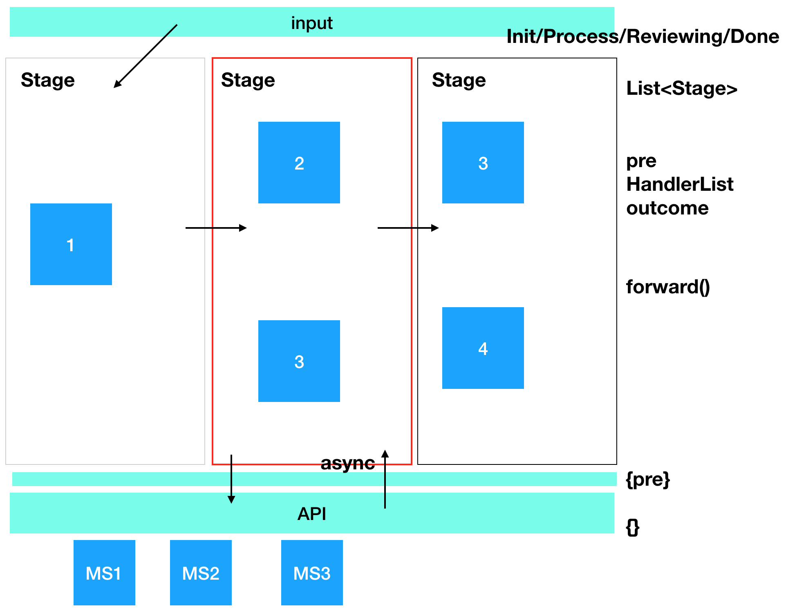
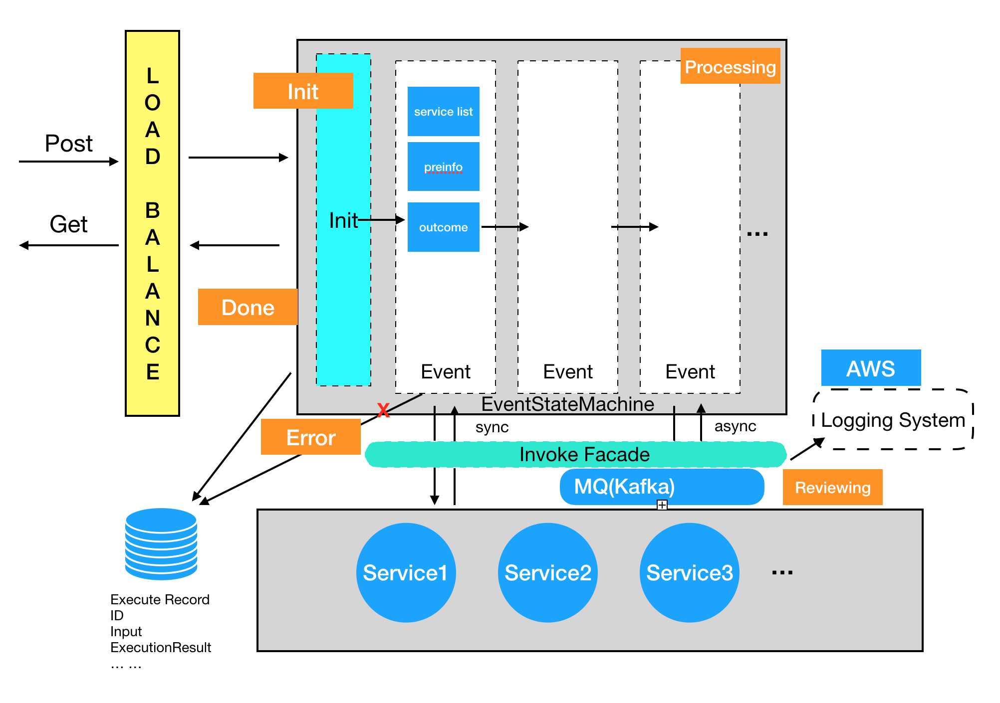

## System Design

System Design 已经逐渐成了面试标配了，这个问题有很多种问法，比如外企会有专门的System Design 面，从架构，技术选型。API，到DB，表结构 等持续1小时左右的面试，当前阶段国内有些公司也会面，但大多没那么严谨，可能就几分钟。不过这已经越来越成为面试必备项了，所以作为单独页面拆分开来准备也是有必要的（BTW，这不比考八股好玩？）。

* **设计一个延迟在10ms以内，QPS 在10000的服务，需要考虑哪些点，或者怎么设计（技术选型等）（得物）**
  * 这种题一般问简历上没有实际高并发经验的人（比如我 Orz），属于抛个方向看看你有没有做过这方面研究，属于答得好不加分，答不上减分的题。最好分治，说一些基本的理解，表示至少你知道一些基本的东西
  * 缓存（多读少写场景）
  * 异步（系统解耦，消息队列）
  * 数据库（索引，分库分表，读写分离）
  * [high-concurrency-design.md](https://github.com/doocs/advanced-java/blob/main/docs/high-concurrency/high-concurrency-design.md)

* **设计一个服务，用于实时统计一个直播间的在线人数（技术选型，实现等）（Shopee）**
  * 

* **设计一个点赞系统（字节跳动）**
  * 这个题当时拿到就开始讲，其实这种做法是不对的，点赞千千万，有对朋友圈的点赞，有对文章的点赞，视频的点赞
  * 是否需要查看点赞的具体人数，点赞是否能取消（这可以决定你的存储如何设计，如果不需要记录由谁点赞，可以做成批处理，减少对DB的访问，pre-aggregate）
  * [Design a system that tracks the number of “likes”](https://medium.com/@morefree7/design-a-system-that-tracks-the-number-of-likes-ea69fdb41cf2)

* **如果当前系统访问量（比如下单量）扩展10倍，有哪些方面需要考量（Shopee）**

* **设计一个Event Driven Framework（Nvidia）**

  * 需求：由多个微服务构成一个pipeline，下一个执行哪个微服务依赖于之前的中间生成数据，设计一个类似这样的Event Driven Framework（可包括DB, API等）

    

  * 面试时（基本毫无思路，瞎整了上面这一张图）：

    1. 抽象化流程，用一种什么数据结构表示运行的状态（我答List<Stage>，每个Stage 包含一个HandlerList，表示这个状态可以接收/调用的微服务列表（基于pre决定调用哪一个），输出outconde到下一个 ）
    2. 微服务要考虑同/异步调用（在面试官提醒下，我说考虑添加状态（如Reviewing表示正在等到调用结果），并引入MQ消费调用过程）

  * 面试后：

  * 自己想了一下，其实也就是在上边基础上优化，不知道ok不ok，反正这面算通过了

    

  * 或许在API和存储方面（表结构）也可以再展开一下

  

* **如何设计一个秒杀系统（小红书）**

  * 应付答案见 [Java开发面试：高并发秒杀系统如何设计与优化](https://blog.csdn.net/CSDN_Terence/article/details/77744042) / [如何设计一个秒杀系统](https://blog.csdn.net/suifeng3051/article/details/52607544)
  * 进阶执行方案见 [如何设计一个百万级用户的抽奖系统](https://note.youdao.com/ynoteshare1/index.html?id=5c04dccbffd0b6fc511dc920e6be12e3&type=note) （携程大佬）
  * 详细实战经验见 [秒杀系统设计与实现.互联网工程师进阶与分析](https://github.com/qiurunze123/miaosha)
  * 面试装逼可看 [如何设计一个秒杀系统](https://time.geekbang.org/column/article/40153) 

* **权限管理是如何设计的（项目相关，也可以作为一个单独的System Design 题）(星环)**  

* **一个前端页面，需要加载一个大的数据集（横坐标为时间，纵坐标为数据），还需要支持缩放，点击查看元数据等功能，可从前后端角度讲讲怎么设计和优化（开放题）（Nvidia）**

* **设计一个ATM系统（微软）**
  * ATM
    * [ATMInfo, State]
    * autherUser()
  * User
    * [UserInfo, availableBalance, totalBalance] (金额信息也可以单独成 Account对象，或者方法调用) 
    * makeTransaction() --> 统一的事务操作对象（查询 / 存入 / 提现 / 转账）
    * 注：此处可以讨巧，问一个用户是否应该只有一张卡，如果是，设计可以省一些事情
  * Card
    * [No, CardInfo, pin]
  * Transation (由BankService 调用 ，不同Bank具体实现)
    * 所有操作（查询 / 存入 / 提现 / 转账）均继承自Transaction (Type / Status)
  * [ATM — An Object-Oriented Design](https://medium.com/swlh/atm-an-object-oriented-design-e3a2435a0830) （OOP设计思路）
  * [Design an ATM](https://github.com/tssovi/grokking-the-object-oriented-design-interview/blob/master/object-oriented-design-case-studies/design-an-atm.md)
  * [ATM LOW LEVEL DESIGN ](https://www.youtube.com/watch?v=_ppHN3SeFnw) （YouTube low level design of OOP）
  * [Database design: Calculating the Account Balance](https://stackoverflow.com/questions/4373968/database-design-calculating-the-account-balance)

* **设计一个日志系统**
  * 需求：设计一个日志收集系统，手机端网页端的client发送数据过来，然后有两种使用场景，一种是data analyst需要用原始数据写sql做分析，另一种dashboard，可以拉时间条，显示时间段里的统计数量

* **设计一个分布式Rate Limiter**

* **设计一个物流系统**

