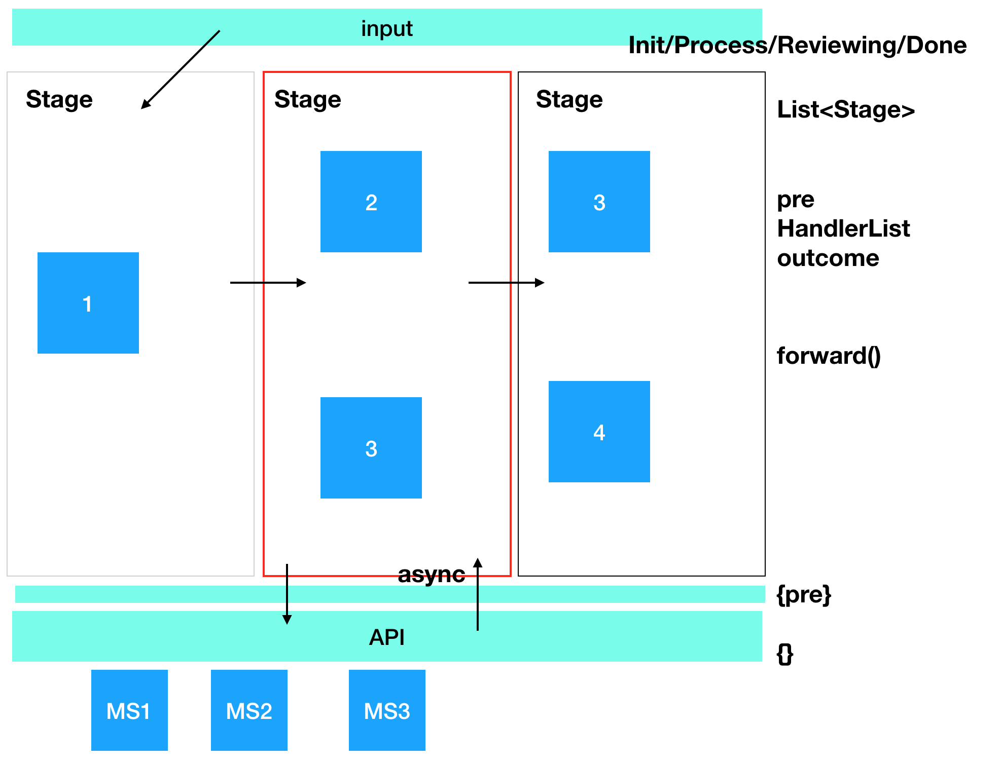
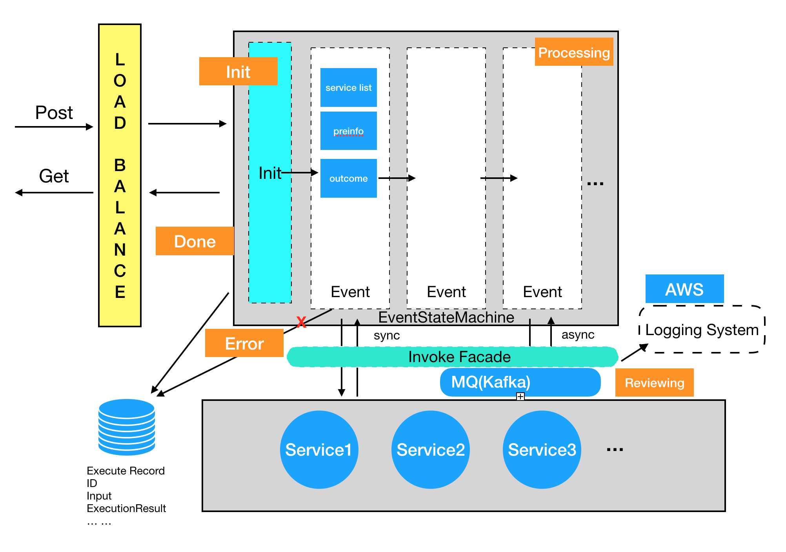

## Event Driven Framework

* 需求：由多个微服务构成一个pipeline，下一个执行哪个微服务依赖于之前的中间生成数据，设计一个类似这样的Event Driven Framework（可包括DB, API等）

  

* 面试时（基本毫无思路，瞎整了上面这一张图）：

  1. 抽象化流程，用一种什么数据结构表示运行的状态（我答List<Stage>，每个Stage 包含一个HandlerList，表示这个状态可以接收/调用的微服务列表（基于pre决定调用哪一个），输出outconde到下一个 ）
  2. 微服务要考虑同/异步调用（在面试官提醒下，我说考虑添加状态（如Reviewing表示正在等到调用结果），并引入MQ消费调用过程）

* 面试后：

* 自己想了一下，其实也就是在上边基础上优化，不知道ok不ok，反正这面算通过了

  

* 或许在API和存储方面（表结构）也可以再展开一下

