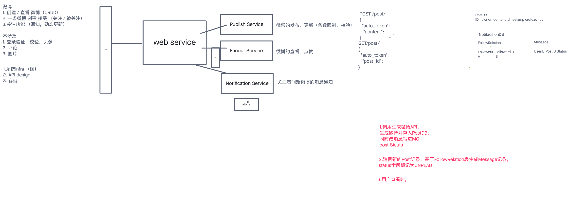

## Weibo

* 需求（Amazon）
  1. 创建 / 查看微博
  2. 关注和被关注者，被关注者发了一条微博后，关注者要能接受到相关微博Feed流
  3. 给出 系统架构 / API / DB设计
* 面试中
  1. 这算是自己第一次纯System Design面试,应该说效果是比较糟糕的,面试官不断让我想好再说,或者说“这样就够了么？”我多次提问"是否make sense"也没有得到一个正面的反馈,整体比较失败,主要真的没经验,无法谈笑风生 Orz
  2. 面试中自己把自己带坑里，说到条数限流，用redis+expire实现，结果这部分也没答得特别满意，最后草草结束了面试（真的菜啊，菜爆了）

* 面试后
  1. 这其实就是一个经典的NewFeed Design，也没有问很多scale，transaction方面的内容，其实属于比较基础的一题
  2. 面试时Fanout on write 和 Fanout on read 的比较和优劣没有讲清楚 （这点其实非常重要，但自己根本没意识到这个问题）
  3. cache的应用没有讲清楚（这点在feed流中很重要）
  4. 微博条数限流讲得也一般
* 参考
  * System Design Interview – An Insider's Guide [Download](https://hubpdf.com/e-books/computers/system-design-interview-pdf-book-free-download/) Chapter 11
  * [Design a News Feed System](https://liuzhenglaichn.gitbook.io/system-design/news-feed/design-a-news-feed-system)
  * [微博和知乎中的 feed 流是如何实现的？](https://www.zhihu.com/question/19645686)